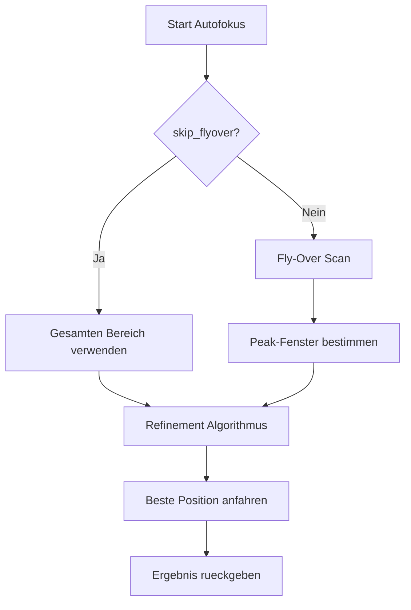
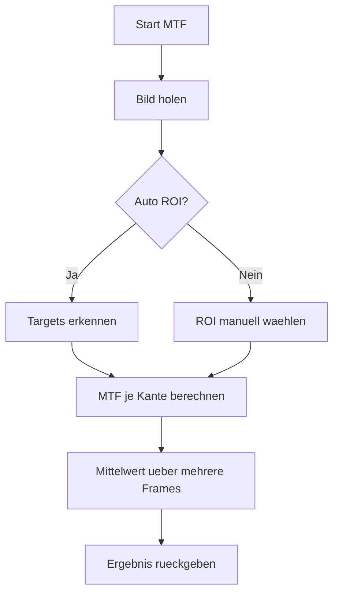
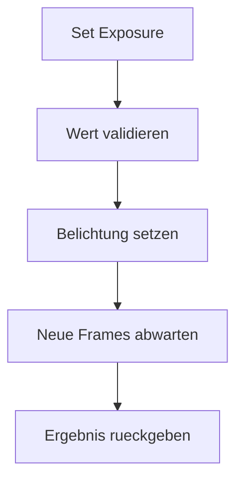

# Camera Callback Benutzerhandbuch (DE)

## Ziel
Dieses Dokument erklaert die Kamera-Services so, dass sie auch ohne Programmierwissen nachvollziehbar sind.

## Was machen die Services?
- `autofocus`: Findet automatisch die beste Fokusposition entlang der X-Achse.
- `measure_mtf`: Misst die optische Schaerfe (MTF) am aktuellen Bild.
- `select_roi`: Laesst einen Bildbereich (ROI) manuell auswaehlen und auswerten.
- `detect_rois`: Erzeugt Debug-Bilder fuer erkannte Testziele.
- `set_exposure`: Setzt die Belichtungszeit der Kamera.

## Ablauf pro Service
### Autofokus


### MTF Messung


### Exposure


## Typische Service-Aufrufe
```bash
ros2 service call /promoc/camera/autofocus promoc_assembly_interfaces/srv/AutoFocus \
"{start_position: 260.0, end_position: 290.0, focus_mode: 0, skip_flyover: false}"
```

```bash
ros2 service call /promoc/camera/measure_mtf promoc_assembly_interfaces/srv/MeasureMTF \
"{auto_roi: true, target_edge: 'any'}"
```

```bash
ros2 service call /promoc/camera/set_exposure promoc_assembly_interfaces/srv/SetExposure \
"{exposure_time: 12000.0}"
```

## Ergebnisinterpretation
- `success=true`: Service erfolgreich abgeschlossen.
- `status_message`: Kurztext mit Messzusammenfassung oder Fehlerhinweis.
- Autofokus:
- `best_focus_position`: beste Achsposition in mm.
- `best_focus_value`: beste Fokus-Metrik.
- MTF:
- `mtf50`, `mtf20`, `mtf10`: schaerfe-relevante Kennwerte (lp/mm).

## Glossar
- `ROI`: Region of Interest, ein ausgeschnittener Bildbereich.
- `MTF50`: Frequenz, bei der der Kontrast auf 50% gefallen ist.
- `Peak`: Maximum einer Kurve (hier meist bester Fokusbereich).
- `SNR`: Signal-zu-Rausch-Verhaeltnis.
- `Fly-Over`: schneller Scan durch den kompletten Fokusbereich.

## Troubleshooting Checkliste
1. Kein Bild verfuegbar:
- Kamera-Stream pruefen (`/promoc/assembly_camera/.../image_raw`).
2. Autofokus findet kein Ziel:
- Beleuchtung pruefen, Kontrast erhoehen, Start/End-Bereich vergroessern.
3. MTF liefert ungueltig:
- Testtarget sichtbar? Kantenkontrast ausreichend? Richtige ROI?
4. Axis Service nicht verfuegbar:
- Ist der Linearachsen-Node gestartet und im richtigen Namespace?
