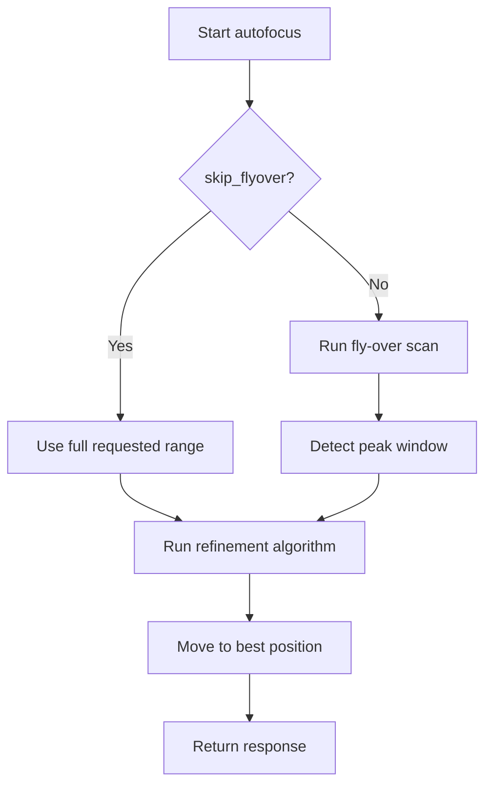
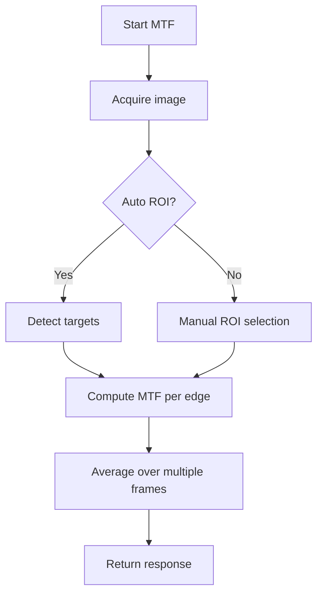
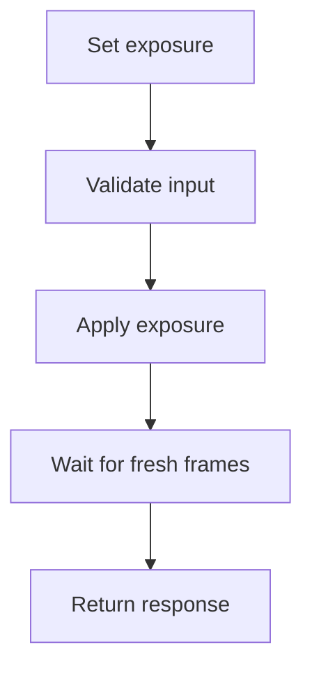

# Camera Callback User Guide (EN)

## Purpose
This guide explains the camera services in plain language so they are understandable even without coding knowledge.

## What each service does
- `autofocus`: Automatically finds the best focus position on the X axis.
- `measure_mtf`: Measures optical sharpness (MTF) on the current image.
- `select_roi`: Lets you manually select an image region (ROI) and evaluate it.
- `detect_rois`: Produces debug images for detected test targets.
- `manual_set_exposure`: Sets the camera exposure time.

## Service flow
### Autofocus


### MTF measurement


### Exposure


## Typical service calls
```bash
ros2 service call /camera_node/autofocus promoc_assembly_interfaces/srv/AutoFocus \
"{start_position: 260.0, end_position: 290.0, focus_mode: 0, skip_flyover: false}"
```

```bash
ros2 service call /camera_node/measure_mtf promoc_assembly_interfaces/srv/MeasureMTF \
"{auto_roi: true, target_edge: 'any'}"
```

```bash
ros2 service call /camera_node/manual_set_exposure promoc_assembly_interfaces/srv/ManualSetExposure \
"{exposure_time: 12000.0}"
```

## How to read results
- `success=true`: service completed successfully.
- `status_message`: short summary or failure explanation.
- Autofocus:
- `best_focus_position`: best axis position in mm.
- `best_focus_value`: best focus metric.
- MTF:
- `mtf50`, `mtf20`, `mtf10`: sharpness-related metrics (lp/mm).

## Glossary
- `ROI`: Region of Interest, cropped image area.
- `MTF50`: frequency where contrast drops to 50%.
- `Peak`: maximum of a curve (best focus region here).
- `SNR`: signal-to-noise ratio.
- `Fly-over`: fast scan across the full focus range.

## Troubleshooting checklist
1. No image available:
- Check camera stream topic (`/promoc/assembly_camera/.../image_raw`).
2. Autofocus cannot detect target:
- Check illumination, improve contrast, widen start/end range.
3. Invalid MTF result:
- Is the target visible? Is edge contrast sufficient? Correct ROI?
4. Axis service unavailable:
- Confirm linear-axis node is running in the expected namespace.
